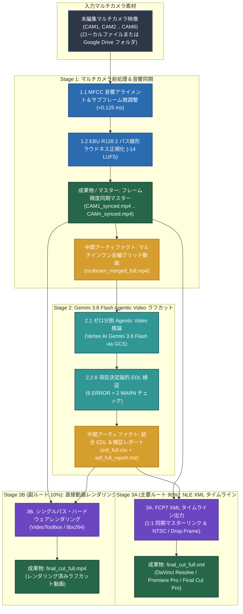

# Multi-Camera Video Pipeline & AI Editing Suite

[English (en)](README.md) | [繁體中文 (zh-TW)](README.zh-TW.md) | [简体中文 (zh-CN)](README.zh-CN.md) | [日本語 (ja)](README.ja.md) | [한국어 (ko)](README.ko.md)

---

> [!IMPORTANT]
> **Google Antigravity ネイティブプラグイン＆ワークフロースイート**  
> 本ツールキットは、**Google Antigravity**（**Vertex AI Gemini 3.8 Flash** 搭載）およびプロ向け NLE（**DaVinci Resolve**、**Adobe Premiere Pro**、**Final Cut Pro**）向けの 3 ステージ・マルチカメラ前処理＆AI ラフカットスイートです。

---

**Multi-Camera Video Pipeline & AI Editing Suite** は、2〜6 台のカメラ映像の音響同期、ラウドネス正規化、AI ラフカットタイムライン生成、およびマルチカメラプレビュー動画レンダリングを実行します。Antigravity チャット画面で自然言語で指示するだけで、マルチカメラ前処理からラフカット生成までを自動実行します。

---

## この fork のインストールとローカル認証

[a0359627 の fork](https://github.com/a0359627/multicam-video-preprocessing) の `feat/gemini-3.8-test-c-workflow` ブランチを使用してください。原作者は [sylphlin](https://github.com/sylphlin/multicam-video-preprocessing) です。3 ステージ・全長動画ワークフローを維持しています。詳細は [チーム向けインストール・利用ガイド（繁体字中国語）](docs/INSTALL.zh-TW.md) を参照してください。

Python >= 3.10 が必要です（3.11 または 3.12 を推奨）。FFmpeg（ffprobe を含む）、Git、Google Cloud CLI は別途インストールします。以下は macOS 用の例です。Windows のインストールと編集ソフトへの読み込みは未検証です。

```bash
git clone --branch feat/gemini-3.8-test-c-workflow --single-branch https://github.com/a0359627/multicam-video-preprocessing.git
cd multicam-video-preprocessing
python3 -m venv .venv
source .venv/bin/activate
python -m pip install -r requirements.txt
gcloud auth application-default login
gcloud auth application-default set-quota-project panmedia-internal-ge
export GOOGLE_CLOUD_PROJECT=panmedia-internal-ge
export GOOGLE_CLOUD_LOCATION=global
export GCS_BUCKET=panmedia-test-488409-agent-staging
```

権限を付与済みのメンバーは既存の project と bucket を利用します。**新しい PC の準備で `setup.sh` を実行しないでください。** クラウド資源、IAM、ライフサイクルを作成・変更するため、別環境を明示的に構築する管理者専用です。各自のアカウントで認証し、他人の ADC、token、`.env` をコピーしないでください。plugin として使う場合も、同じ fork とブランチを plugin ディレクトリに clone し、そこで依存関係の導入と認証を行います。

## 外部マスター音声は任意、アップロードは自動分離

- Stage 1 に `--master-audio /path/to/OBS.mkv` または WAV 録音を指定できます。音声から基準カメラとのずれを計測し、`multicam_sync.json` に保存します。信頼度が低い場合や必要区間をカバーできない場合は停止します。固定のオフセット、個人のパス、フレームレート、解像度は使いません。
- **OBS がなくても XML と MP4 を出力できます。** `--master-audio` を省略すると同期済みカメラ音声を使用します。カメラ 2 台ともステレオなら XML は 4 音声トラック、ステレオマスターありでは 6 トラック（マスターを有効、カメラ音声は無効で保持）です。モノラル素材は実際のチャンネル数を保持します。MP4 は同期済みマスターを優先し、なければ各音声を `1/N` の比率で連続ミックスします。XML には同じゲインを保持し、編集者が調整できます。音声同期には各素材が共通の音を記録している必要があります。
- 各ジョブは `raw/<ジョブ固有ID>/<ファイル名>` にアップロードします。同じ実行内のリトライは再利用し、新しい実行では新たにアップロードします。ローカルのファイル名変更は不要です。`--cleanup-gcs` はそのジョブがアップロードしたオブジェクトだけを削除し、直接渡した `gs://` 入力は削除しません。保存期間は従来どおり `raw/` 2 日、成果物 15 日です。
- 素材ごとに別のローカル出力ディレクトリを使います。XML 読み込み後にメディアのリンクと冒頭・中間・末尾の同期を確認してください。書き出し成功だけでは編集品質の承認にはなりません。

### ディレクトリ構造（Agent Plugins 1.0 準拠）
- **SSOT 実体ディレクトリ**：`skills/multicam-video-preprocessing/`（`SKILL.md`、`scripts/`、`assets/` を格納）を単一の信頼できる情報源とし、ルートの `scripts` と `assets` は POSIX シンボリックリンクとして構成されています。
- **2 層 `AGENTS.md` 構成**：ルートの `AGENTS.md` は開発・エンジニアリング規約（Part I & Part II）を定義し、`rules/AGENTS.md` はプラグインに同梱される AI クライアント実行時ルール（`<PLUGIN_ROOT>` からの直接 CLI 実行、読み取り専用、Fail-Fast）を定義します。

---

## 3 ステージ実行ワークフローアーキテクチャ



---

## 利用シナリオと Agent プロンプト例 (User Scenarios & Agent Prompts)

### シナリオ 1：NLE 用 FCP7 XML タイムライン出力（推奨メインワークフロー）
- **ユースケース**：AI ラフカットのカメラ切り替え判定を DaVinci Resolve、Adobe Premiere Pro、または Final Cut Pro に読み込み、本編集やカラーグレーディングを行います。
- **Agent プロンプト例**：
  > *「`CAM1.mp4` と `CAM2.mp4` を同期してラウドネスを -14 LUFS に正規化し、DaVinci Resolve 用の FCP7 XML ラフカットタイムラインを出力して。」*
- **生成される成果物**：
  1. `final_cut_full.xml`（カメラ切り替え点と理由マーカーを含むタイムライン）。
  2. `CAM1_synced.mp4`、`CAM2_synced.mp4`（時間同期および `-14 LUFS` 正規化済みカメラマスター）。

### シナリオ 2：ラフカット動画の直接レンダリング
- **ユースケース**：NLE を開かずに、カメラ切り替え済みの MP4 プレビュー動画を直接レンダリングします。
- **Agent プロンプト例**：
  > *「これらのマルチカメラ映像を AI ラフカットして、`final_cut_full.mp4` を直接レンダリングして。」*
- **生成される成果物**：
  1. `final_cut_full.mp4`（シングルパス・ハードウェアレンダリング済み動画）。
  2. `edl_full.csv` および `edl_full_report.md`（カメラ切り替えリストと 8 項目検証レポート）。

### シナリオ 3：Google Drive フォルダからのマルチカメラ同期＆ラフカット
- **ユースケース**：Google Drive 共有フォルダ内の全カメラ映像を MD5 キャッシュ検証付きで自動取得し、同期からタイムライン出力まで一括実行します。
- **Agent プロンプト例**：
  > *「Google Drive フォルダ `https://drive.google.com/drive/folders/FOLDER_ID` のマルチカメラ素材を同期・正規化して、FCP7 XML タイムラインを生成して。」*
- **生成される成果物**：
  1. `CAM1_synced.mp4` .. `CAMn_synced.mp4`（同期・ラウドネス正規化済みマスター）。
  2. `edl_full.csv`、`edl_full_report.md`、`final_cut_full.xml`。

---

## 3 ステージ技術概要

1. **Stage 1（マルチカメラ同期＆前処理）**：MFCC 音響アライメント＆サブフレーム微調整（`<0.125 ms`）、EBU R128（`-14 LUFS`）2 パス線形ラウドネス正規化、フレーム精度同期マスター出力（`CAM*_synced.mp4`）、およびゼロ分割グリッド合成（`multicam_merged_full.mp4`）を実行します。
2. **Stage 2（Gemini 3.8 Flash Agentic Video ラフカット）**：**Vertex AI Gemini 3.8 Flash**（`processing="agentic"`）でカウントダウンやカチンコを自動除去して `edl_full.csv` を生成し、8 項目の決定論的 EDL 検証（`6 ERROR + 2 WARN`）を実行します。
3. **Stage 3A & 3B（FCP7 XML タイムライン出力 / シングルパス動画レンダリング）**：NTSC 非整数フレームレート（`23.976`, `29.97`, `59.94`）やドロップフレームに対応した `final_cut_full.xml` の出力、または `final_cut_full.mp4` の直接レンダリングを行います。

---

## GCS 2 階層ライフサイクルポリシー (`gs://<GCS_BUCKET>`)

| GCS パス接頭辞 (`matchesPrefix`) | 保存対象 | 保持期間 (`age`) | クリーンアップ動作 |
| :--- | :--- | :--- | :--- |
| **`raw/`** | 一時グリッド動画 (`multicam_merged_full.mp4`) | **2 日間 (`age: 2`)** | ジョブごとに分離し、2 日後に自動削除します。ジョブ間のキャッシュ再利用はしません。 |
| **`output/`**、**`deliverables/`**、**`multicam_assets/`** | XML/CSV タイムライン、レンダリング動画、検証レポート | **15 日間 (`age: 15`)** | チーム確認用に 15 日間保持した後、自動削除します。 |

---

## ライセンス (License)

本プロジェクトは [MIT License](LICENSE) の下で提供されています。
