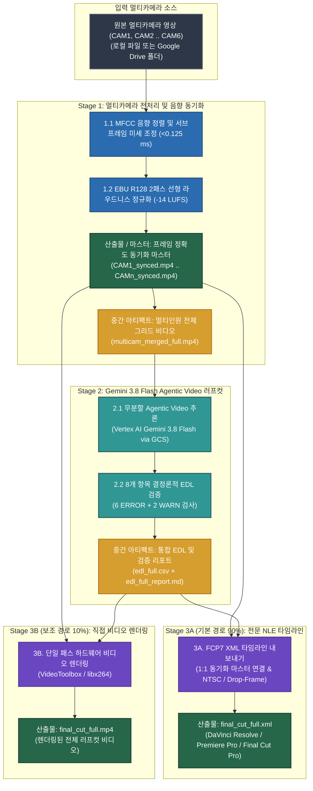

# Multi-Camera Video Pipeline & AI Editing Suite

[English (en)](README.md) | [繁體中文 (zh-TW)](README.zh-TW.md) | [简体中文 (zh-CN)](README.zh-CN.md) | [日本語 (ja)](README.ja.md) | [한국어 (ko)](README.ko.md)

---

> [!IMPORTANT]
> **Google Antigravity 네이티브 플러그인 및 워크플로 스위트**  
> 본 툴킷은 **Google Antigravity**(**Vertex AI Gemini 3.8 Flash** 기반) 및 전문 NLE 소프트웨어(**DaVinci Resolve**, **Adobe Premiere Pro**, **Final Cut Pro**)를 위한 3단계 멀티카메라 전처리 및 AI 러프컷 스위트입니다.

---

**Multi-Camera Video Pipeline & AI Editing Suite**는 2~6대 카메라 음향 동기화, 방송 표준 라우드니스 정규화, AI 러프컷 타임라인 생성 및 멀티카메라 프리뷰 비디오 렌더링을 수행합니다. Antigravity 채팅 창에서 자연어로 지시하면 멀티카메라 동기화부터 러프컷 생성까지 전체 워크플로를 자동으로 수행합니다.

---

## 이 fork 설치 및 로컬 인증

[a0359627의 fork](https://github.com/a0359627/multicam-video-preprocessing)의 `feat/gemini-3.8-test-c-workflow` 브랜치를 사용하세요. 원작자는 [sylphlin](https://github.com/sylphlin/multicam-video-preprocessing)입니다. 전체 길이 영상을 처리하는 3단계 작업 흐름을 유지합니다. 자세한 절차는 [팀 설치 및 사용 안내서(번체 중국어)](docs/INSTALL.zh-TW.md)를 참조하세요.

Python >= 3.10이 필요하며 3.11 또는 3.12를 권장합니다. FFmpeg(ffprobe 포함), Git, Google Cloud CLI는 별도로 설치하세요. 아래 예시는 macOS용입니다. Windows 설치와 편집 프로그램 가져오기는 아직 검증하지 않았습니다.

```bash
git clone --branch feat/gemini-3.8-test-c-workflow --single-branch https://github.com/a0359627/multicam-video-preprocessing.git
cd multicam-video-preprocessing
python3 -m venv .venv
source .venv/bin/activate
python -m pip install -r requirements.txt
gcloud auth application-default login
gcloud auth application-default set-quota-project panmedia-internal-ge
export GOOGLE_CLOUD_PROJECT=panmedia-internal-ge
export GOOGLE_CLOUD_LOCATION=global
export GCS_BUCKET=panmedia-test-488409-agent-staging
```

권한을 부여받은 팀원은 기존 project와 bucket을 사용합니다. **새 컴퓨터 설치 과정에서 `setup.sh`를 실행하지 마세요.** 클라우드 리소스, IAM 및 수명 주기를 생성하거나 변경하므로 별도 환경을 구축하도록 명시적으로 허가받은 관리자만 사용합니다. 각자 본인 계정으로 인증하고 다른 사람의 ADC, token 또는 `.env`를 복사하지 마세요. plugin으로 설치할 때도 같은 fork와 브랜치를 plugin 디렉터리에 clone한 뒤 의존성 설치와 인증을 진행합니다.

## 외부 마스터 오디오는 선택 사항, 업로드 자동 분리

- Stage 1에 `--master-audio /path/to/OBS.mkv` 또는 WAV 녹음 파일을 지정할 수 있습니다. 소리로 기준 카메라에 자동 정렬하고 결과를 `multicam_sync.json`에 저장합니다. 신뢰도가 낮거나 필요한 구간을 녹음이 포함하지 못하면 중단합니다. 고정 오프셋, 개인 경로, 프레임 속도 또는 해상도를 사용하지 않습니다.
- **OBS 없이도 XML과 MP4를 출력할 수 있습니다.** `--master-audio`를 생략하면 동기화된 카메라 오디오를 사용합니다. 두 카메라가 모두 스테레오면 XML은 오디오 4트랙이며, 스테레오 마스터가 있으면 6트랙입니다(마스터 활성화, 카메라 트랙은 보존하되 비활성화). 모노 소스는 실제 채널 수를 보존합니다. MP4는 정렬된 마스터를 우선 사용하고, 없으면 각 카메라 오디오를 `1/N` 비율로 연속 믹싱합니다. XML은 동일한 게인을 보존하여 편집자가 조정할 수 있습니다. 음향 동기화에는 소스에 공통으로 녹음된 소리가 필요합니다.
- 각 작업은 `raw/<고유 작업 ID>/<파일명>`에 업로드합니다. 같은 실행 내 재시도는 해당 객체를 재사용하지만 새 실행은 새로 업로드합니다. 로컬 파일명을 바꿀 필요가 없습니다. `--cleanup-gcs`는 해당 작업이 업로드한 객체만 삭제하며 직접 제공한 `gs://` 입력은 삭제하지 않습니다. 보존 기간은 기존대로 `raw/` 2일, 결과물 15일입니다.
- 녹화 건마다 별도의 로컬 출력 디렉터리를 사용하세요. XML을 편집 프로그램으로 가져온 뒤 미디어 연결과 처음・중간・끝의 영상/음성 동기화를 확인하세요. 내보내기 성공만으로 편집 품질이 승인되는 것은 아닙니다.

### 디렉터리 구조 (Agent Plugins 1.0 표준)
- **SSOT 실제 디렉터리**: `skills/multicam-video-preprocessing/`(`SKILL.md`, `scripts/`, `assets/` 포함)를 단일 진실 공급원(SSOT)으로 사용하며 루트 `scripts` 및 `assets`는 POSIX 심볼릭 링크로 연결됩니다.
- **2계층 `AGENTS.md` 구성**: 루트 `AGENTS.md`는 워크스페이스 및 개발 표준(Part I & Part II)을 정의하고, 플러그인 내부의 `rules/AGENTS.md`는 AI 클라이언트 실행 규칙(`<PLUGIN_ROOT>` 직접 CLI 호출, 읽기 전용, Fail-Fast)을 정의합니다.

---

## 3단계 엔드투엔드 워크플로 아키텍처



---

## 사용 시나리오 및 Agent 프롬프트 예시 (User Scenarios & Agent Prompts)

### 시나리오 1: 전문 NLE용 FCP7 XML 타임라인 내보내기 (권장 기본 워크플로)
- **사용 사례**: AI 러프컷 카메라 전환 결정을 DaVinci Resolve, Adobe Premiere Pro 또는 Final Cut Pro로 가져와 정밀 편집 및 색보정을 수행합니다.
- **Agent 프롬프트 예시**:
  > *"`CAM1.mp4`와 `CAM2.mp4`를 동기화하고 라우드니스를 -14 LUFS로 정규화한 뒤, DaVinci Resolve용 FCP7 XML 러프컷 타임라인을 내보내 줘."*
- **산출물**:
  1. `final_cut_full.xml` (카메라 전환 지점 및 편집 사유 마커가 포함된 타임라인).
  2. `CAM1_synced.mp4`, `CAM2_synced.mp4` (시간 정렬 및 `-14 LUFS` 정규화가 완료된 카메라 마스터).

### 시나리오 2: 멀티카메라 러프컷 비디오 직접 렌더링
- **사용 사례**: NLE 소프트웨어를 열지 않고 카메라 전환이 완료된 MP4 프리뷰 비디오를 직접 렌더링합니다.
- **Agent 프롬프트 예시**:
  > *"이 멀티카메라 영상들을 AI 러프컷하고 `final_cut_full.mp4`로 직접 렌더링해 줘."*
- **산출물**:
  1. `final_cut_full.mp4` (단일 패스 하드웨어 가속으로 렌더링된 전체 비디오).
  2. `edl_full.csv` 및 `edl_full_report.md` (카메라 전환 결정표 및 8개 항목 검증 리포트).

### 시나리오 3: Google Drive 폴더에서 멀티카메라 동기화 및 러프컷 수행
- **사용 사례**: 멀티카메라 원본이 저장된 Google Drive 폴더 링크를 전달하여 원격 MD5 캐시 검증과 함께 동기화 및 타임라인 생성을 자동으로 수행합니다.
- **Agent 프롬프트 예시**:
  > *"Google Drive 폴더 `https://drive.google.com/drive/folders/FOLDER_ID`의 멀티카메라 영상을 다운로드하여 오디오 동기화 및 -14 LUFS 정규화를 수행하고 FCP7 XML 타임라인을 생성해 줘."*
- **산출물**:
  1. `CAM1_synced.mp4` .. `CAMn_synced.mp4` (동기화 및 라우드니스 정규화 마스터).
  2. `edl_full.csv`, `edl_full_report.md`, `final_cut_full.xml`.

---

## 3단계 핵심 기술 개요

1. **Stage 1 (멀티카메라 동기화 및 전처리)**: MFCC 음향 정렬 및 서브프레임 미세 조정(`<0.125 ms`), EBU R128(`-14 LUFS`) 2패스 선형 라우드니스 정규화, 프레임 정확도 동기화 마스터 출력(`CAM*_synced.mp4`), 무분할 전체 그리드 합성(`multicam_merged_full.mp4`)을 수행합니다.
2. **Stage 2 (Gemini 3.8 Flash Agentic Video 러프컷)**: **Vertex AI Gemini 3.8 Flash**(`processing="agentic"`)로 카운트다운 및 슬레이트를 제거하여 `edl_full.csv`를 생성하고 8개 항목의 결정론적 EDL 검증(`6 ERROR + 2 WARN`)을 수행합니다.
3. **Stage 3A & 3B (FCP7 XML 타임라인 내보내기 / 단일 패스 비디오 렌더링)**: NTSC 소수점 프레임 레이트(`23.976`, `29.97`, `59.94`) 및 드롭 프레임(Drop-Frame)을 지원하는 `final_cut_full.xml`을 내보내거나 `final_cut_full.mp4`를 직접 렌더링합니다.

---

## GCS 2단계 수명 주기 정책 (`gs://<GCS_BUCKET>`)

| GCS 경로 접두사 (`matchesPrefix`) | 저장 객체 | 보관 기간 (`age`) | 정리 방식 |
| :--- | :--- | :--- | :--- |
| **`raw/`** | 스테이징된 그리드 비디오 (`multicam_merged_full.mp4`) | **2일 (`age: 2`)** | 작업별로 분리하여 2일 후 자동 삭제합니다. 서로 다른 작업 간 캐시는 재사용하지 않습니다. |
| **`output/`**, **`deliverables/`**, **`multicam_assets/`** | XML/CSV 타임라인, 렌더링 비디오 및 검증 리포트 | **15일 (`age: 15`)** | 팀 검토를 위해 15일간 보관한 후 자동 삭제합니다. |

---

## 라이선스 (License)

이 프로젝트는 [MIT License](LICENSE)에 따라 라이선스가 부여됩니다.
