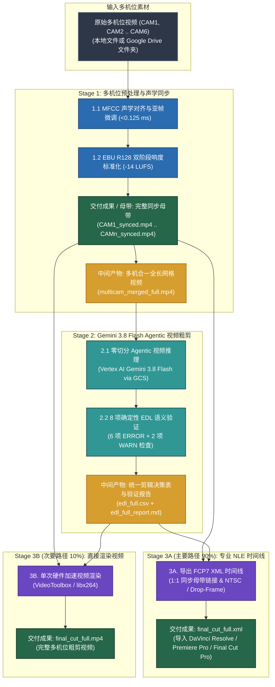

# Multi-Camera Video Pipeline & AI Editing Suite

[English (en)](README.md) | [繁體中文 (zh-TW)](README.zh-TW.md) | [简体中文 (zh-CN)](README.zh-CN.md) | [日本語 (ja)](README.ja.md) | [한국어 (ko)](README.ko.md)

---

> [!IMPORTANT]
> **Google Antigravity 原生技能与工作流套件**  
> 本工具集为 **Google Antigravity**（由 **Vertex AI Gemini 3.8 Flash** 驱动）与专业非线性剪辑软件（**DaVinci Resolve**、**Adobe Premiere Pro**、**Final Cut Pro**）打造三阶段多机位预处理与 AI 粗剪工作流。

---

**Multi-Camera Video Pipeline & AI Editing Suite** 支持 2 至 6 机位音频对齐、广播级响度标准化、AI 粗剪时间线生成与多机位预览视频渲染。直接在 Antigravity 对话窗口使用自然语言下达指令，即可由 Agent 自动执行多机位同步与粗剪工作流。

---

## 安装此 fork 与本机授权

请使用 [a0359627 的 fork](https://github.com/a0359627/multicam-video-preprocessing)，指定 `feat/gemini-3.8-test-c-workflow` 分支。原作者为 [sylphlin](https://github.com/sylphlin/multicam-video-preprocessing)，本版保留三阶段、全长视频工作流。完整步骤见 [同事安装与使用指南（繁体中文）](docs/INSTALL.zh-TW.md)。

需要 Python >= 3.10，推荐 3.11 或 3.12；另行安装 FFmpeg（含 ffprobe）、Git 和 Google Cloud CLI。以下终端示例适用于 macOS；Windows 安装和剪辑软件导入尚未验证。

```bash
git clone --branch feat/gemini-3.8-test-c-workflow --single-branch https://github.com/a0359627/multicam-video-preprocessing.git
cd multicam-video-preprocessing
python3 -m venv .venv
source .venv/bin/activate
python -m pip install -r requirements.txt
gcloud auth application-default login
gcloud auth application-default set-quota-project panmedia-internal-ge
export GOOGLE_CLOUD_PROJECT=panmedia-internal-ge
export GOOGLE_CLOUD_LOCATION=global
export GCS_BUCKET=panmedia-test-488409-agent-staging
```

已获授权的同事使用现有 project 和 bucket。**新电脑安装不要运行 `setup.sh`**：它会创建或修改云资源、IAM 和生命周期，仅供管理员明确要另建环境时使用。每人用自己的账号登录，不复制他人的 ADC、token 或 `.env`。安装为 plugin 时，也须将同一 fork、同一分支 clone 到 plugin 目录，再安装依赖和登录。

## 外录母带可选，上传自动隔离

- Stage 1 可加 `--master-audio /path/to/OBS.mkv` 或 WAV 录音文件，自动按声音对齐参考相机并写入 `multicam_sync.json`。对齐置信度低或母带无法覆盖所需时段时停止，不使用固定偏移、个人素材路径或固定帧率／分辨率。
- **没有 OBS 也能输出 XML 和 MP4。** 未指定 `--master-audio` 时使用已同步的相机音频。两台相机均为立体声时，XML 保留四条相机音轨；加入立体声母带则为六条，默认启用母带、保留但禁用相机音轨。单声道素材按实际声道数保留。MP4 优先使用对齐母带，否则按每路 `1/N` 连续混合已同步的相机音频；XML 保留相应音量供剪辑师调整。声学同步需要素材中共同录到的声音。
- 每次任务自动上传到 `raw/<任务唯一编号>/<文件名>`。同次执行内部重试复用该对象，重新启动任务则重新上传，本地无需改名。`--cleanup-gcs` 只清理本次上传的对象，不删除直接提供的 `gs://` 输入。生命周期仍为 `raw/` 2 天、交付物 15 天。
- 每组素材使用独立的本地输出目录。XML 导入剪辑软件后，检查媒体链接及首／中／尾视听同步；成功导出不代表剪辑质量已获接受。

### 项目目录结构（Agent Plugins 1.0 标准规范）
- **SSOT 实体目录**：`skills/multicam-video-preprocessing/`（内含 `SKILL.md`、`scripts/` 与 `assets/`），根目录 `scripts` 与 `assets` 为指向该目录的 POSIX symlinks。
- **双层 `AGENTS.md` 规范**：根目录 `AGENTS.md` 定义工作区与工程开发规范（Part I & Part II），`rules/AGENTS.md` 随 Plugin 打包注入 AI 客户端执行期守则（定位 `<PLUGIN_ROOT>` 直接调用 CLI、只读与 Fail-Fast）。

---

## 三阶段端到端工作流架构



---

## 使用场景与 Agent 指令示例 (User Scenarios & Agent Prompts)

### 场景 1：导出专业 NLE XML 时间线（推荐主要工作流）
- **适用场景**：将 AI 多机位粗剪决策导入 DaVinci Resolve、Adobe Premiere Pro 或 Final Cut Pro 进行精剪与调色。
- **Agent 指令示例**：
  > *“帮我同步 `CAM1.mp4` 和 `CAM2.mp4`，将响度标准化到 -14 LUFS，并导出可导入 DaVinci Resolve 的 FCP7 XML 粗剪时间线。”*
- **交付成果**：
  1. `final_cut_full.xml`（包含机位切换切点与剪辑理由标记的时间线）。
  2. `CAM1_synced.mp4`、`CAM2_synced.mp4`（已完成毫秒级对齐与 `-14 LUFS` 响度标准化的同步母带）。

### 场景 2：直接渲染多机位粗剪成品视频
- **适用场景**：无需打开剪辑软件，直接输出完成机位切换的 MP4 预览或成品视频。
- **Agent 指令示例**：
  > *“帮我把这几支多机位视频做 AI 粗剪，并直接渲染生成 `final_cut_full.mp4`。”*
- **交付成果**：
  1. `final_cut_full.mp4`（单次硬件加速渲染的完整视频）。
  2. `edl_full.csv` 与 `edl_full_report.md`（机位切换决策表与 8 项语义验证报告）。

### 场景 3：从 Google Drive 文件夹执行多机位同步与粗剪
- **适用场景**：直接提供存放多机位素材的 Google Drive 文件夹链接，由 Agent 自动下载（含远程 MD5 缓存校验）、同步并导出粗剪时间线。
- **Agent 指令示例**：
  > *“从这个 Google Drive 文件夹 `https://drive.google.com/drive/folders/FOLDER_ID` 下载多机位视频，完成音频同步与 -14 LUFS 标准化，并导出 FCP7 XML 时间线。”*
- **交付成果**：
  1. `CAM1_synced.mp4` .. `CAMn_synced.mp4`（同步与响度标准化母带）。
  2. `edl_full.csv`、`edl_full_report.md` 与 `final_cut_full.xml`。

---

## 三阶段核心技术说明

1. **Stage 1（多机位同步与预处理）**：执行 MFCC 声学时间对齐与亚帧微调（`<0.125 ms`）、EBU R128（`-14 LUFS`）双阶段线性响度标准化、逐帧精准同步母带导出（`CAM*_synced.mp4`）与零切分全长网格合成（`multicam_merged_full.mp4`）。
2. **Stage 2（Gemini 3.8 Flash Agentic 粗剪决策）**：使用 **Vertex AI Gemini 3.8 Flash**（`processing="agentic"`）对全长网格视频生成 `edl_full.csv`，自动剔除片头倒数与场记板，并执行 8 项确定性语义检查（`6 ERROR + 2 WARN`）。
3. **Stage 3A & 3B（导出 FCP7 XML 时间线 / 硬件加速视频渲染）**：支持 NTSC 分数帧率（`23.976`, `29.97`, `59.94`）与丢帧时间码（Drop-Frame）导出 `final_cut_full.xml`，或直接单次硬件渲染 `final_cut_full.mp4`。

---

## GCS 双层生命周期规则 (`gs://<GCS_BUCKET>`)

| GCS 路径前缀 (`matchesPrefix`) | 存储对象 | 保留天数 (`age`) | 清理机制 |
| :--- | :--- | :--- | :--- |
| **`raw/`** | 暂存网格视频 (`multicam_merged_full.mp4`) | **2 天 (`age: 2`)** | 每次任务使用独立路径，2 天后自动清理，不跨任务复用缓存。 |
| **`output/`**、**`deliverables/`**、**`multicam_assets/`** | XML/CSV 时间线、渲染视频与验证报告 | **15 天 (`age: 15`)** | 保留 15 天供团队审阅，期满自动清理。 |

---

## 许可证 (License)

本项目采用 [MIT License](LICENSE) 授权。
