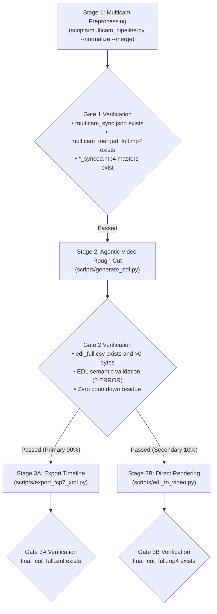

# Multi-Camera Video Pipeline & AI Editing Suite (Antigravity Native Skill)

Universal end-to-end toolkit for multi-camera video production (2 to 6 Cameras), AI-assisted long-form video editing (Gemini 3.8 Flash 1M Token Context via Vertex AI), and professional NLE timeline export (DaVinci Resolve / Adobe Premiere Pro / Final Cut Pro).

---

## Prerequisites & Environment

- **Google Antigravity IDE / Agent Framework**
- **FFmpeg / ffprobe** with `loudnorm`; VideoToolbox is used when available, with software encoding fallback.
- **Python 3.10+** (3.11 or 3.12 recommended), a virtual environment and dependencies from the repository root `requirements.txt`. Windows installation and NLE import remain unverified.
- **Cloud Credentials (100% ADC + Vertex AI & GCS)**:
  - Authenticate via `gcloud auth application-default login`
  - Team handoff: use `GOOGLE_CLOUD_PROJECT=panmedia-internal-ge`, `GOOGLE_CLOUD_LOCATION=global`, `GCS_BUCKET=panmedia-test-488409-agent-staging` and `gcloud auth application-default set-quota-project panmedia-internal-ge`. See [installation guide](../../docs/INSTALL.zh-TW.md).
  - Authorized team members use the existing resources. Do not run `setup.sh` during workstation installation; it changes cloud resources, IAM and lifecycle policies. It is only for administrators explicitly provisioning a separate environment.
  - Install from `https://github.com/a0359627/multicam-video-preprocessing`, branch `feat/gemini-3.8-test-c-workflow`. Upstream author credit remains sylphlin. Never copy another user's ADC, tokens or secret files.

---

## Modular Toolset Architecture

| Step | Script | Core Module (`scripts/modules/`) | Function |
| :--- | :--- | :--- | :--- |
| **Step 1** | `scripts/multicam_pipeline.py` | `audio_sync.py`, `audio_normalizer.py`, `video_composer.py` | MFCC Acoustic Sync + Subframe Refinement (0.125ms), EBU R128 (-14 LUFS), Synced Masters, Multi-in-One Full Grid (`multicam_merged_full.mp4`) |
| **Step 2** | `scripts/generate_edl.py` | `llm_client.py`, `gcp_client.py`, `progress.py`, `edl_validator.py`, `assets/prompt_c_portable.md` | Vertex AI Gemini 3.8 Flash Agentic Video Understanding (ADC + GCS `gs://` URI) + EDL Validation -> `edl_full.csv` + Report |
| **Step 3A** | `scripts/export_fcp7_xml.py` | `reporter.py`, `time_utils.py`, `edl_validator.py` | Full-length EDL CSV -> FCP7 XML (`final_cut_full.xml`) for DaVinci / Premiere (EDL validation, NTSC float fps & drop-frame support) |
| **Step 3B** | `scripts/edl_to_video.py` | `video_composer.py`, `edl_validator.py` | Hardware-accelerated clip cutting directly from synced masters -> `final_cut_full.mp4` (with EDL validation) |

---

## Core Technical Principles

1. **MFCC Acoustic Time Alignment & Subframe Refinement (<0.125ms Accuracy)**:
   - Multi-camera synchronization is computed via pure numpy MFCC cross-correlation with a 3-tier fallback ladder (Fast 120s scan -> Full-length MFCC -> Raw waveform fallback) and localized time-domain subframe acoustic refinement, achieving sub-millisecond physical accuracy (<0.125ms, single audio sample at 8kHz) with 97.7% lower memory consumption. Evaluated against BBC standard score thresholds ($Z \ge 12.0$ High `✓ Aligned`, $7.0 \le Z < 12.0$ Medium `ℹ Aligned (marginal)`, $Z < 7.0$ Low `⚠️ LOW CONFIDENCE` + stderr warnings & Summary Gate). Passing `--strict-sync` exits non-zero on low confidence. Synchronized camera masters (`CAM*_synced.mp4`) default to hardware-accelerated frame-accurate re-encoding (`h264_videotoolbox` / `libx264 -crf 18`), eliminating stream-copy keyframe snapping drift and black-frame stutter.
2. **EBU R128 Two-Pass Linear Loudness Normalization**:
   - Audio tracks are normalized to $-14.0\text{ LUFS}$ ($LRA=11.0\text{ LU}$, $TP=-1.5\text{ dBTP}$) compliant with YouTube broadcast standards. Uses two-pass analysis: Pass 1 null-sink acoustic measurement, Pass 2 linear gain offset (`linear=true`) to eliminate dynamic pumping artifacts.
3. **Zero-Split Agentic Video Architecture (No Chapter Slicing Required)**:
   - Evaluates full-length multicam footage (>1 hour) end-to-end via Vertex AI Gemini 3.8 Flash Agentic Video Understanding (`processing="agentic"`). Goal-directed sparse sampling reduces token usage by **99.7%** (from ~1,000,000 to ~3,000 tokens), completely eliminating sentence bisection and multi-part complexity.
4. **Token-Optimized Compact Grid Composition**:
   - Merges 2 to 6 camera angles into a single multi-view canvas ($\le 1920 \times 1080$, each CAM $\ge 640 \times 480$), reducing AI multimodal token consumption by **50% to 83%**.
5. **Universal Pre-roll & Countdown Elimination (Zero-Tolerance & Asymmetric Safety Margin)**:
   - Systematically purges all on-set countdown noises ("5, 4, 3, 2, 1", "五四三二", "Ready Action") and pre-roll clutter. Enforces asymmetric safety margins where the start point is self-verified on the `[Start, Start+2s]` window to guarantee the opening frame aligns cleanly with the speaker's true opening word.
6. **100% Pure Vertex AI (ADC) & GCS Cloud Architecture (Zero AI Studio Keys)**:
   - All model calls and multimodal media ingestion run exclusively on **Google Cloud Vertex AI** (`GOOGLE_CLOUD_LOCATION=global`) authenticated via Application Default Credentials (`gcloud auth application-default login`). Media assets are staged to **Google Cloud Storage** (`gs://<GCS_BUCKET>/raw/<job UUID>/<filename>`) with job-scoped upload reuse. Internal retries reuse that job's object; a new invocation creates a new upload path. `--cleanup-gcs` only deletes objects uploaded by the current job and never deletes directly supplied `gs://` inputs. Lifecycle retention remains 2 days for `raw/` and 15 days for `output/`, `deliverables/`, `multicam_assets/`.
7. **Deterministic EDL Semantic Validation & `--strict-edl` Safeguard**:
   - Pre-flight semantic validation covering 8 structural dimensions across 3 execution points (before disk write in `generate_edl.py`, and on EDL loading in `export_fcp7_xml.py` and `edl_to_video.py`). Evaluates 6 critical ERRORs (`E_NO_ROWS`, `E_PARSE_TIME`, `E_NEGATIVE_DURATION`, `E_NON_MONOTONIC`, `E_OVERLAP`, `E_EMPTY_CAMERA`) and 2 WARNs (`W_UNKNOWN_CAMERA`, `W_GAP`). Passing `--strict-edl` halts execution with exit code 1 on ERROR (default warns and continues; `generate_edl.py` always writes bad data to disk before exit for post-mortem inspection). Supports report localization via `--lang` (built-in `en` and `zh-TW`, with silent fallback to `en`), customizable gap threshold via `--edl-max-gap-sec` (default: `0.05`), and camera whitelist via `--edl-known-cameras` (defaults to `^CAM\d+$` regex in generator, auto-inferred from media directory in exporter/renderer).

---

## Portable Audio and Editing Defaults

- External master audio is optional: Stage 1 `--master-audio <WAV_OR_OBS_MKV>` aligns it acoustically to the reference camera and records offset, confidence and coverage in `multicam_sync.json`. Low-confidence alignment or insufficient required coverage stops the job. Do not reuse benchmark offsets or infer offsets from file modification times.
- Without a master, both XML and MP4 use synchronized camera audio. Grid and MP4 use a continuous equal `1/N` mix, independent of picture cuts. XML keeps separate camera audio tracks with matching gains for the editor to adjust. Two stereo cameras produce four camera tracks without a master, or six tracks with a stereo master (master enabled, camera tracks retained but disabled). Mono sources retain their actual channel count.
- Sources need common recorded sound for acoustic synchronization. Use `--strict-sync` and a new output directory per recording. Read media properties from this job; do not assume a fixed frame rate, resolution or path.
- Default `assets/prompt_c_portable.md` carries Test C natural editing rhythm with no old speaker identities or transcript. Historical `prompt_c_natural_rhythm.md` and `scripts/benchmarks/interview_test_c/` are reference material, not the portable entry point. Keep full-length analysis and the existing three-stage sequence.

## 3-Stage Gated Execution Runbook

When executing a multi-camera task, follow this sequential 3-stage gated workflow. Resolve `${SKILL_DIR}` to the directory containing this `SKILL.md` (or the repository root).



### Stage 1: Physical Preprocessing (Sync, Normalization, Master Export, Grid Merge)
- **User Status Update**: `"正在進行多機位時間對齊與音量標準化..."` (localized to user's language)
- **Execution Command**:
  ```bash
  # Local Camera Files or Google Drive File Links:
  python3 "${SKILL_DIR}/scripts/multicam_pipeline.py" \
    --ref <CAM1.mp4_OR_GDRIVE_LINK> --targets <CAM2.mp4_OR_GDRIVE_LINK...> \
    --normalize --merge --strict-sync -o <OUTPUT_DIR>

  # Optional external master: add --master-audio <WAV_OR_OBS_MKV> above.
  # Omit it for camera-only audio; OBS is not required.

  # Or Direct Google Drive Folder URL / Folder ID (Auto-discovers & sorts CAM1..CAMn via ADC):
  python3 "${SKILL_DIR}/scripts/multicam_pipeline.py" \
    --gdrive-folder "<GDRIVE_FOLDER_URL_OR_ID>" \
    --normalize --merge --strict-sync -o <OUTPUT_DIR>
  ```
- **Exit Gate 1 Verification (Mandatory before Stage 2)**:
  - `<OUTPUT_DIR>/multicam_sync.json` exists with valid offset data.
  - All camera masters listed by `cameras[].synced_path` in the sync JSON exist and are non-empty; filenames retain the input stem/extension and need not start with `CAM`.
  - `<OUTPUT_DIR>/multicam_merged_full.mp4` grid video exists and is non-empty.
  - If a master was supplied, its measured alignment and valid coverage are recorded and the referenced master file exists and is readable. Stop on master alignment/coverage failure.
  - Without a master, verify the synchronized camera audio is present for both XML and MP4 delivery.

### Stage 2: Gemini AI Multimodal Rough-Cut (Agentic Video EDL Generation)
- **User Status Update**: `"正在進行 Agentic Video AI 鏡頭剪輯分析..."` (localized to user's language)
- **Execution Command**:
  ```bash
  python3 "${SKILL_DIR}/scripts/generate_edl.py" \
    -v <OUTPUT_DIR>/multicam_merged_full.mp4 \
    --strict-edl --lang <zh-TW|en>
  ```
- **Exit Gate 2 Verification (Mandatory before Stage 3)**:
  - `<OUTPUT_DIR>/edl_full.csv` exists and size $> 0\text{ bytes}$.
  - Deterministic EDL semantic validation passed with zero `ERROR` issues (`E_NO_ROWS`, `E_PARSE_TIME`, `E_NEGATIVE_DURATION`, `E_NON_MONOTONIC`, `E_OVERLAP`, `E_EMPTY_CAMERA`).
  - `<OUTPUT_DIR>/edl_full_report.md` exists with cutting rationale and validation report table.

### Stage 3A: Export NLE Timeline (Primary Path / 90% Use Case)
- **User Status Update**: `"正在匯出剪輯時間線 (XML)..."` (localized to user's language)
- **Execution Command**:
  ```bash
  python3 "${SKILL_DIR}/scripts/export_fcp7_xml.py" \
    -d <OUTPUT_DIR> -o <OUTPUT_DIR>/final_cut_full.xml \
    --strict-edl --lang <zh-TW|en>
  ```
- **Exit Gate 3A Verification**:
  - `<OUTPUT_DIR>/final_cut_full.xml` exists and size $> 0\text{ bytes}$.
  - Verify linked media, independently editable audio tracks and beginning/middle/end sync in the intended NLE. A file-existence check does not establish editorial acceptance.

### Stage 3B: Direct Video Rendering (Secondary Fast Preview Path / 10% Use Case)
- **User Status Update**: `"正在渲染影片成片..."` (localized to user's language)
- **Execution Command**:
  ```bash
  python3 "${SKILL_DIR}/scripts/edl_to_video.py" \
    --edl <OUTPUT_DIR>/edl_full.csv --media-dir <OUTPUT_DIR> \
    -o <OUTPUT_DIR>/final_cut_full.mp4 --strict-edl --lang <zh-TW|en>
  ```
- **Exit Gate 3B Verification**:
  - `<OUTPUT_DIR>/final_cut_full.mp4` exists with duration $> 0$ and an audible audio stream.
  - Listen at beginning/middle/end and picture-cut boundaries; distinguish successful rendering from human acceptance.
